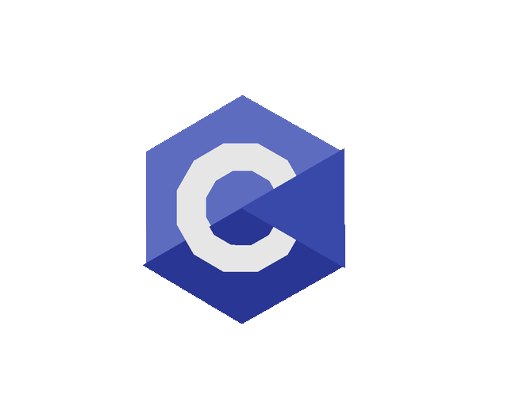
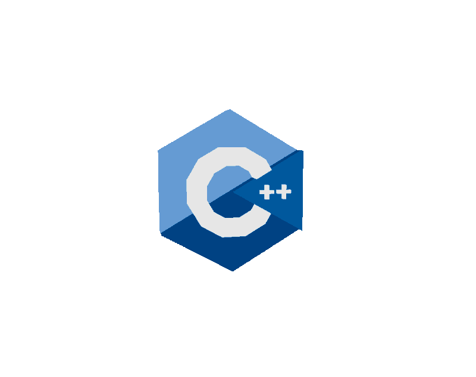
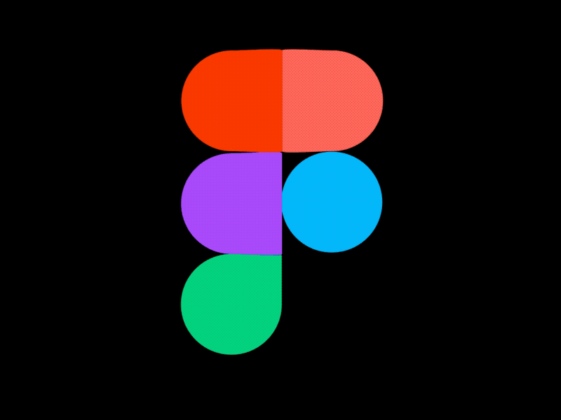
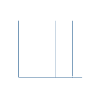
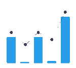

<h1 align="center">Rohan Mulla</h1>
<h3 align="center">Programming Enthusiast • Competitive Programmer</h3>

  

---

## 🔗 Profiles

  
  
  
  
  
  

---

##  About Me

I am a **competitive programming–oriented developer** with a strong focus on  
**Data Structures & Algorithms**, **problem solving**, and **writing optimized code**.

- 🧠 Solid understanding of **DSA & OOP**
- ⚙️ Comfortable with **C, C++, Python, JavaScript**
- 🧪 Regular participant in **online contests**
- 📈 Actively working on improving **ratings, consistency, and problem-solving depth**
- 🎯 Goal-oriented and passionate about clean, efficient code
- 🌱 Constantly learning and expanding my skill set

 

---

## 🏆 Competitive Programming

### 📊 Contest Ratings

- 🟠 *Codeforces*: 868
- 🔵 *CodeChef*: 1401 (2★)
- ⏱️ *WakaTime*: 100+ hours

  
  &nbsp;&nbsp;
  
  &nbsp;&nbsp;
  
  &nbsp;&nbsp;
  

##  My Competitive Programming Profiles

  
  
  
  
  

 
  <h2 align="center">Codeforces Info</h2> 
  

<!-- LeetCode -->
<!-- 
 
  <h2 align="center">LeetCode Info</h2>  

  

    
    
    
    
  

  

    
  

 -->

---

## 🧩 Problem Solving Overview

- ✅ **1000+ problems solved** across platforms
- 🟠 Codeforces  
- 🟤 CodeChef  
- 🟡 LeetCode  
- 🟢 HackerRank & GeeksforGeeks  

Consistency and learning from failed submissions are a core part of my growth process.

---

##  Languages and Tools

<table align="center">
  <tr>
    <td align="center" width="96">
      
       C
    </td>
    <td align="center" width="96">
        
       C++
    </td>
    <td align="center" width="96">
        
       Python
    </td>
       <td align="center" width="96">
        
       HTML
    </td>
       <td align="center" width="96">
        
       CSS
  <tr>
      </td>
     <td align="center" width="96">
        
       Git
    </td>
    <td align="center" width="96">
        
       GitHub
    </td>
    <td align="center"  width="96">
        
       VSCode
    </td>
    <td align="center"  width="96">
        
       Tailwind
    </td>
    </td>
        <td align="center" width="96">
        
       Figma
  </tr>
</table>

---

##  Current Statistics

  <table>
    <tr>
      <td>
        
      </td>
      <td>
        
      </td>
    </tr>
    <!-- <tr>
      <td colspan="2" align="center">
        
      </td>
    </tr> -->
    
  </table>

---
##  My Contribution Graph

## 📫 Contact

  
  

---

## 🤝 Project Contributions

  

---

  

  

